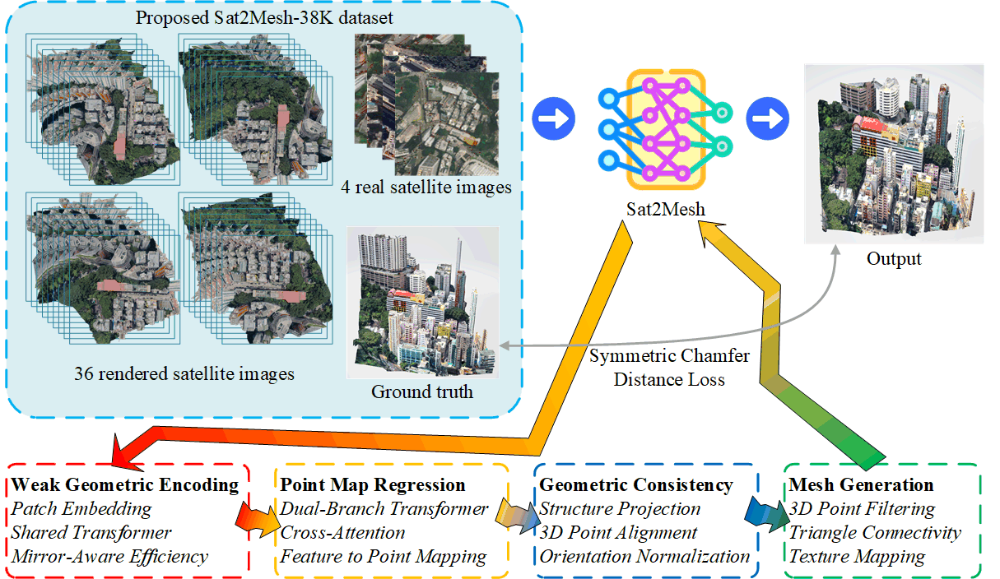

# Sat2Mesh: Satellite-to-Mesh Urban Modeling from Multi-view Satellite Images for City-scale 3D Reconstruction

Official implementation of the paper:

**Sat2Mesh: Satellite-to-Mesh Urban Modeling from Multi-view Satellite Images for City-scale 3D Reconstruction**

---

## 🌍 Abstract

City-scale 3D modeling from satellite images is essential for applications such as digital city reconstruction, urban planning, and traffic simulation. However, conventional 3D reconstruction paradigms often rely on precise camera intrinsics and pose priors, which are typically unavailable in satellite imagery.

To address this limitation, we present **Sat2Mesh**, a novel end-to-end framework for directly generating high-fidelity triangle mesh models from sparse-view satellite images, without requiring any geometric priors. Our method leverages a **Transformer-based architecture** to encode weak geometric cues across multiple views and regress 3D point clouds aligned in a shared coordinate space. A **geometric consistency fusion module** further refines spatial alignment, followed by **graph-based surface reconstruction** to produce structured mesh outputs.

To support this task, we introduce **Sat2Mesh-7K**, a new dataset comprising **7,744 samples** of multi-view satellite imagery paired with **Level of Detail 3 (LoD-3)** building mesh models.

Experimental results on Sat2Mesh-7K demonstrate the effectiveness of our approach in reconstructing city-scale 3D structures from uncalibrated, sparse-view inputs.

## 🔗 Live Demo

You can try Sat2Mesh online via Hugging Face Spaces:  
👉 [https://huggingface.co/spaces/awhitewhale/sat2mesh?status=active](https://huggingface.co/spaces/awhitewhale/sat2mesh?status=active)

🕒 Note: Training and testing code will be released upon acceptance of the paper.

## 📦 Dataset: Sat2Mesh-7K

- **Real Satellite Image + GLB Mesh 66.8 GB**  
  📥 [Download from OneDrive](https://1drv.ms/f/c/bb3d431e33a5aa64/Euszx4QVIxlKn_IBtol-QDYBsziOIRN1KC1ZWBIhXz1qJA?e=VChtDT)

- **Rendered Multi-view Satellite Images 106 GB**  
  📥 [Download from OneDrive (Due to OneDrive sharing restrictions, the upload has not started as of 21:00 UTC+8.)](#)

  📥 [Download from Quark Netdisk (Still uploading, not fully uploaded as of 21:00 UTC+8.)](https://pan.quark.cn/s/65a49ad76a6f?pwd=NPVV)

- 🧪 **Demo Subset 1.25 GB (40 samples)**  
  A small-scale version for quick testing and exploration  
  📥 [Download from OneDrive](https://1drv.ms/f/c/bb3d431e33a5aa64/EqYeFp3gVVZDrCpTpjU6UEkB-J1Su5NEfSsbiNfNHNnQyA?e=oX7hxr)

## 🛠️ Features
- End-to-end triangle mesh reconstruction from real satellite images

- No need for camera intrinsics or pose priors

- Transformer backbone with point graph regression

- Geometric consistency fusion and 3D alignment

- Training and inference scripts provided

- Compatible with Sat2Mesh-7K dataset

## 👤 About the Author

This project is developed and maintained by Yifan Liu,
🔗 [More about the author](https://awhitewhale.github.io/liuyifan/).
